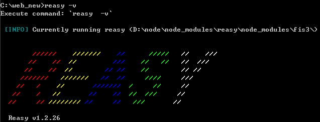
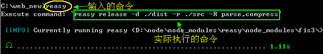
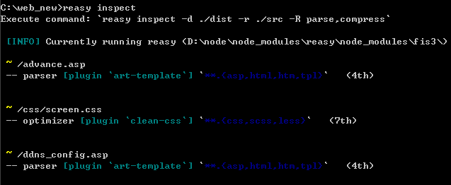

## 介绍

> Reasy是什么?

Reasy是**面向纯前端的工程自动化构建工具**。它基于百度的FIS3构建，并在此基础上针对特定开发场景进行了特色化封装。相比FIS3，它具有以下特点 ：

 * 更易安装。FIS3为了保持其通用性，所以只保留了其基本功能，而其它功能则以插件的形式存在，用户往往要安装很多其它插件才能完成构建任务。Reasy将前端会用到的模块进行了打包，做到`即装即用`。
 * 命令更精简。Reasy保留了FIS3的所有命令语法，但在其基础上进行了智能化的语法精简。如FIS3编译命令为:`fis3 release -r ./src -d ./dist`，使用Reasy则只需输入`reasy`即可。并且自带右键编译，不输入命令也可以即时编译。
 * 配置更精简。FIS3实现各种功能的配置虽然相对其他前端自动化工具精简了很多，但是在使用中还是会感觉有点麻烦。有些插件的配置还需要经过查找说明文档。Reasy对前端常用模块及插件的配置进行了封装，如使用压缩你只需在`fis-conf.js`里面写`fis.extend('compress')`即可。
 * 插件更可靠。FIS3的官方插件一般不成问题，而其第3方插件则稂莠不齐，普遍存在用法不详及无人维护的情况。所以像基他的基于FIS构建的个性化构建工具都会自建插件仓库（FIS3目前已经开始尝试解决此问题）。Reasy将前端可能会用到的插件模块进行了精心筛选，并为此编写（或改写）了一部分插件，力求确保所有内置插件都稳定可靠。
 * 更利于团队部署。分别针对Windows和Linux两大平台编写了一键安装和内网部署安装脚本，更有利于平台集成。


Reasy 目前内置的插件集有(FIS3内置的除外)：

 * `reasy-parser-sass`，sass编译插件，增加了对node-sass最新功能的支持，并解决了国内用户安装不上的问题
 * `fis-parser-less`, less编译插件
 * `fis-hook-modules`, 模块化插件, 可以对Amd,Cmd等模块化方案进行一键封装
 * `fis-parse-art-template`, 对artTemplate前端模板编译进行了封装，实现模板静态预编译
 * `fis3-hook-iconfont`, svg图标自动转字体文件的插件
 * `fis-lint-jshint`, 基于jshint的静态代码检查插件
 * `fis-postprocessor-autoprefixer`, css私有前缀自动补全插件
 * `fis-parse-js-macro`, js宏定义预处理插件
 * `reasy-command-b28`, b28多国语自动转化插件
 * `fis-optimizer-html-minifier`, html压缩插件
 * `reasy-command-rules`, 该插件主要用于检测用可用规则。
 * `fis3-hook-relative`, 相对路径生成插件
 * `reasy-postpackager-qunit`, 自动化单元测试插件,该插件目前存在部分用户安装不上的问题，所有暂时没有内置。
 * `fis3-deploy-replace`, 多路径发布插件
 * `web-debug`, 纯前端调试辅助工具。


 Reasy 目前内置的规则有:

 * relative 将绝对路径转化为相对路径(注：FIS3默认会将源码里的相对路径改为绝对路径，如需保留相对路径，请在编译时加上 `-R relative` )
 * autoprefix  可以实现css自动添加私有前缀
 * compress 对css,js,png进行压缩
 * parse 对sass,less,art-template进行编译
 * sprite 对sass,less,css添加雪碧图
 * md5 将文件名修改为md5形式
 * sea 对sea.js模块进行封装
 * mod 对modj.s模块进行封装
 * require 对require.js模块进行封装
 * jshint 对js进行lint，进行lint时记得在命令行后加上`-l`或`--lint`
 * qunit 自动进行单元测试,需要自行安装`reasy-postpackager-qunit`,即`npm install -g reasy-postpackager-qunit`
 * iconfont 根据svg图标自动打包生成iconfont字体及相关样式
 * ldeploy 本地发布
 * debug 去除压缩属性


## 安装

 首先你得安装node, 下载路径为: http://www.nodejs.org/
 然后打开cmd,输入

     npm install reasy -g

 > 如安装不上，可使用[一键安装脚本](https://raw.githubusercontent.com/wEasyTeam/reasy/master/reasy-install.bat)进行安装

 > PS: Linux下如无Node环境可以使用全自动安装脚本进行安装

 > 安装成功后会显示Reasy LOGO及其版本号：
  

 > 升级可以使用`npm update reasy -g`或`npm install reasy -g`，也可使用安装脚本进行升级

 > 为了方便调用reasy进行编译，reasy为windows系统封装了右键菜单，下载地址为：[Reasy右键菜单安装](https://raw.githubusercontent.com/wEasyTeam/reasy/master/production/addMenu.bat)，另存为bat文件，然后以管理员权限执行即可。效果如图：
  
 卸载脚本在：[Reasy右键菜单卸载](https://raw.githubusercontent.com/wEasyTeam/reasy/master/production/addMenu.bat)
 

## 起步

### 构建命令

> Reasy是对FIS3是增量封装，所以所有的基础构建方法都可以参考FIS3。这里只介绍Reasy独有的构建命令。

#### 发布
    
    reasy

 **参数说明**
 > 上面的reasy命令进行了很多自动化处理，它会根据当前目录进行分析，自动将其它参数补全，一般补全后的完整命令是: `reasy release -r ./src -d ./dist`。具体补全为什么命令可以通过查看控制台信息得知。如:
  
 
 主要有以下参数：

 * `<media name>`，规则名称，用法: `reasy release product`，`product`即为<media name>，它表示只应用配置文件里的特定规则，和 `fis.media()`相对应。（注：该参数需紧跟`release`）
 * -r 指定项目源文件目录
 * -d 指定项目输出目录
 * -c 清除缓存,缓存有助于加快编译速度，但是有时会出现编译不生效的问题，加此参数即可解决
 * -R 内置规则的引用,如 `reasy release -R compress`,表示启用压缩（不写fis-conf也可以）
 * -w 开启实时监控，代码改动后会自动进行编译，主要方便开发调试
 * -f 指定配置文件，默认为`fis-conf.js`
 * -L 启用liveload实时刷新浏览器，(*注: 该参数会在代码里面加入一段引用liveload.js的代码，所以建议在正式发布时不要加此参数)。如果使用web-debug做为调试服务器，则无需此参数。
 * -l 开启代码检查，一般情况下配置了代码检查规则并不会生效，需要在命令上加上该参数才会生效。如`reasy -R jshint -l`
 * -v 查看版本号
 * -h 查看帮助
 
#### 调试预览

    web-debug 8080 ./dist
    //或
    fis3 server start --type node 

 


#### 查看已存在规则
    
    reasy rules


 > 自定义规则可以放在项目源目录下的rules文件夹里，编写方法跟FIS3配置相似

#### 查看规则匹配情况

    reasy inspect


 


### 配置文件

> 默认配置文件为`reasy-conf.js`(也可以是`fis-cofig.js`，可者通过 `-f`命令参数来指定)。

配置文件主要以下几个方法：

  * `fis.match('**', {/* some settings*/})`, 用于匹配项目文件，引号里面的为glob表达式。如:
    
    ```javascript
     fis.match('**.js', {
         optimizer: 'uglify-js'
         //表示使用`fis-optimizer-uglify-js`对js代码进行压缩
     });
    ```
    
     match里的设置参数主要有:

      * `release: 'path'` 表示发布的路径，为false时表示不发布
      * `query: '?' + Math.random()`  query主要用于给资源文件加上一些参数。此例表示在资源网址后面加上随机数
      * `url: '/sss/dir/$1'` 此参数用在当发布路径与relase路径不一致的时候。如：
             ```javascript
               fis.match('common/js/(**.js)', {
                   url: './js/libs/$1',
                   query: '?t=${timestamp}',
                   release: product + '/js/libs/$1'
               })
             ```
      * `useHash: true|false` 表示是否将文件名转化为md5形式   
      * `packTo: 'some file' 表示将匹配到的文件打包为一个文件 　
      * `parser: 'plugin name'` 预编译插件调用参数,如: `parser: fis.plugin('sass')`,表示为匹配的文件进行sass编译,所调用的插件为`reasy-parser-sass`;
      * `rExt: 'css'  此命令用于修改匹配文件的后缀, 如：`fis.match('**.scss', {rExt: 'css'})`表示将scss文件后缀修改为css文件，一般和parser参数一起使用
      * `optimizer: 'plugin name'` 此参数会调用相对应的压缩插件对文件进行压缩。如`optimizer: fis.plugin('uglify-js')`
      * `lint: 'plugin name'` 调用静态代码检查插件对匹配的文件进行静态检查
      * `hook: 'plugin name'` 调用hook插件
      ...

      > Tips: 有没有发现，上面的parser, optimizer, lint, hook它们的使用方法基本是一样的形式：
        ```javascript
        fis.match('<some file>', {
            '<plugin type>': fis.('<plugin name>', {
                /*<plugin setting>*/
            })
        })
        ```
        其实这些配置只是对应一些插件，FIS3的插件形式一般是 `(fis|fis3|reasy)-<plugin type>-<plugin name>`,如sass编译器是`reasy-parser-sass`,所以它的配置就是`parser: fis.plugin('sass', {settings})`;

        与这些插件对应的构建流程为：

    


  * `fis.media('<media name>')`, 用于指定规则名称，通过在命令行里面添加规则名称，可以只让部分配置生效。如:

    ```javascript
     fis.media('product')//表示以下链式表达式下的配置只在`product`规则下生效
     .match('**.scss', {
         parser: 'sass'
     })
     .match('**.tpl', {
         parser: 'art-template'
     });

    ```
    
  * `fis.config.set()` 此方法可以设置一些变量，可以是系统变量，也可以是自定义变量。如:
    ```javascript
        fis.config.set('project.include', ['/mobile/**]);
        //表示只发布`mobile`目录下的文件。
        fis.config.set('project.exclude', ['**/tpl/**', 'goform/**', 'cgi-bin/**', 'test/**', '**/_*.scss']);
        //表示不发布符合以上规则的文件
    ```

  * `fis.config.get()` 此方法与`fis.config.set()`对应，可以将系统变量或自定义变量取出来。

其他有用的方法：

  * `fis.project.currentMedia()` 可以用于获取当前命令指定的规则`<media name>`
  * `fis.project.getProjectPath()` 可以获取当前项目的工程路径


> match方法里面的参数为glob表达式，用法比正则表达式简单很多，基本上可以实现各种匹配方法。有关glob的详细介绍详见: [FIS3使用说明](http://fis.baidu.com/fis3/docs/api/config-glob.html)

### Reasy的拓展 `reasy.extend`

是不是觉得上面的设置看起来很头疼，没关系，Reasy已经为你封装好了绝大多数插件的配置，而你要使用它只需调用`fis.extend('<some rules>')`。`<some rules>`就是Reasy的内置规则。如果我们需要对项目进行编译，压缩并加上md5,我们只需要在配置文件里面写:

```javascript
reasy.extend('parse').extend('compress').extend('md5')
.match('<some file>', {
    /*other setting*/
});
```
甚至我们可以不用写`fis-conf.js`配置文件，直接上命令: `reasy release -R parse,compress,md5`就可以完成这些功能。

如果你想深入了解这些是如何实现的，可以查看 reasy目录下的rules目录里的js，或者访问[github](https://github.com/wEasyTeam/reasy/tree/master/rules)。

如果你想封装自己的规则，你可以将其放至在reasy的rules目录下或者是自己的工程的rules目录下，然后就可以用`extend`进行调用了。rules规则的一般写法为:
```javascript
  module.exports = function(args) {//args表示要传给规则的参数
      return this.match('**', {/*some settings*/});
  };
```
如果有args则使用`reasy.extend('rulename', args)`调用，多个参数则依次类推


### 插件开发

reasy插件的开发与fis3的插件开发方法完全一样，详见[插件开发](http://fis.baidu.com/fis3/docs/api/dev-plugin.html)


# 下一节， Reasy的内置插件用法